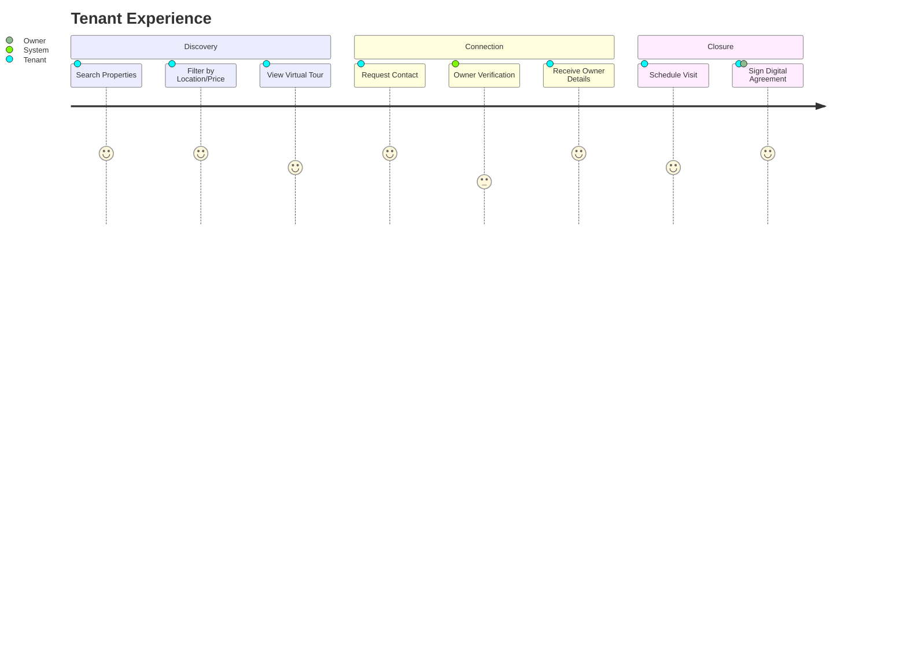

# NoBroker - Rental Marketplace Platform

## 📌 Executive Summary

**NoBroker (Kathmandu Edition)** is a disruptive rental marketplace connecting tenants directly with property owners, eliminating the middleman. This project targets the inefficiencies in the Kathmandu rental market, focusing on transparency, verified listings, and direct communication.

**Problem Solved:**
*   Eliminates hefty brokerage fees (often 1 month's rent).
*   Reduces spam/fake listings through strict verification.
*   Provides a digital agreement and payment trail.

---

## 📂 Repository Structure

This project's documentation is organized for ease of access:

| Document | Description |
| :--- | :--- |
| **[Project Overview](./documentation/01_Project_Overview.md)** | Goals, Scope, and Stakeholders. |
| **[Requirements](./documentation/02_Requirements.md)** | User roles, Permissions, and NFRs. |
| **[API Reference](./documentation/03_API_Reference.md)** | Endpoints, Payloads, and Examples. |
| **[Architecture](./documentation/04_Architecture.md)** | System Design, Database Schema, and Flow Diagrams. |
| **[Use Cases](./documentation/05_Use_Cases.md)** | User Stories and Activity Diagrams. |
| **[Testing Criteria](./documentation/06_Testing.md)** | QA strategy, UAT scenarios, and Test Data. |
| **[Deployment](./documentation/07_Deployment.md)** | Configuration variables and Deployment strategy. |

---

## 🛠️ Technology Stack

*   **Frontend**: React (TypeScript), Tailwind CSS
*   **Backend**: Node.js, Express
*   **Database**: PostgreSQL
*   **Auth**: JWT & OTP Validation

---

## 🔄 User Journey: Tenant

