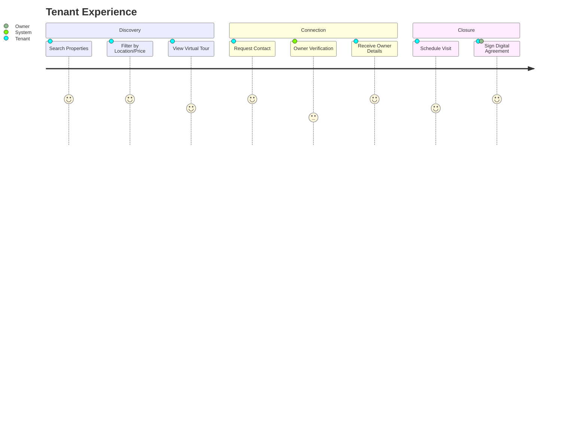

# NoBroker - Rental Marketplace Platform

## 📌 Executive Summary

**NoBroker (Kathmandu Edition)** is a disruptive rental marketplace connecting tenants directly with property owners, eliminating the middleman. This project targets the inefficiencies in the Kathmandu rental market, focusing on transparency, verified listings, and direct communication.

**Problem Solved:**
*   Eliminates hefty brokerage fees (often 1 month's rent).
*   Reduces spam/fake listings through strict verification.
*   Provides a digital agreement and payment trail.

---

## 📂 Repository Structure

The documentation is split for clarity. Please review the specific sections below:

*   **[Full Documentation](./FULL_DOCUMENTATION.md)**: The Master document containing all specifications.
*   **[Diagrams](./diagrams/)**: Visual workflows and ERD.

---

## 🛠️ Technology Stack

*   **Frontend**: React (TypeScript), Tailwind CSS
*   **Backend**: Node.js, Express
*   **Database**: PostgreSQL
*   **Auth**: JWT & OTP Validation

---

## 🔄 User Journey: Tenant

