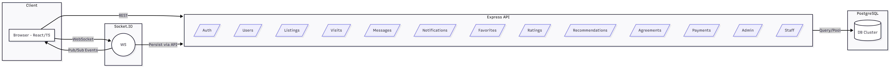
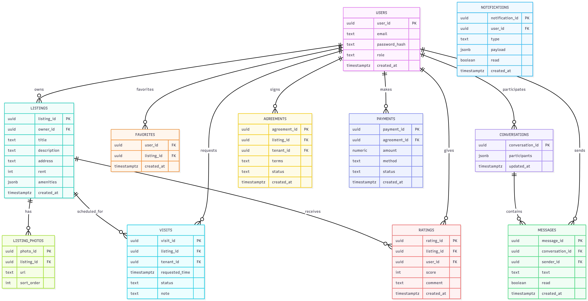
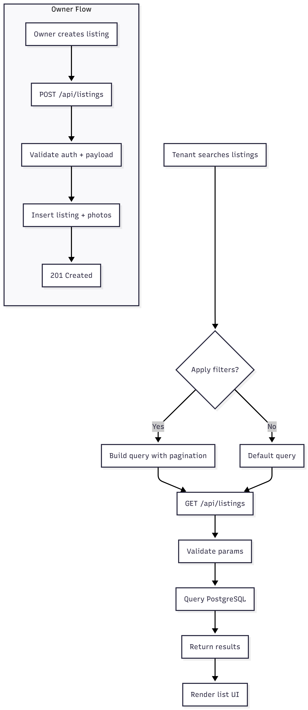
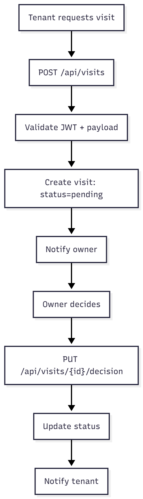
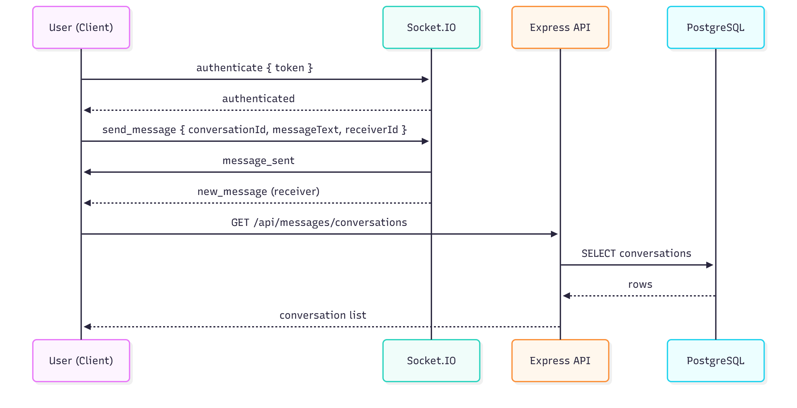

# Technical Architecture

## 🏗️ System Overview
The system follows a modular microservice-like structure (or modular monolith) to separate concerns between listings, messaging, and core user management.

## 🗄️ Database Schema
We use PostgreSQL. Key entities include Users, Listings, Visits, Conversations, and Payments.

## 🔄 Module Flows

### Listings Flow
User creates listing -> Admin validates (optional) -> Published to Search.

### Visit Scheduling
Tenant Request -> Owner Notification -> Owner Action (Approve/Reject) -> Tenant Notification.

### Messaging
Real-time socket connection handling with fallback to database persistence.

