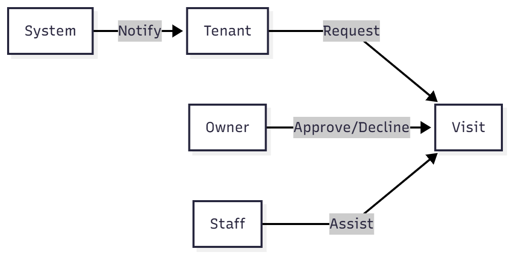

# Use Cases & User Stories

## 🎭 User Stories

### Listings
> **As a tenant**, I want to filter listings by rent and location so that I can find affordable options near my workplace.
*   **Acceptance Criteria**:
    *   Filter parameters (`minRent`, `maxRent`, `location`) return correct subset.
    *   Pagination works correctly.
    *   No 500 errors on invalid inputs.

### Visits
> **As an owner**, I want to approve or decline visit requests so I can manage my availability.
*   **Acceptance Criteria**:
    *   Decision is instantly persisted in DB.
    *   Tenant receives real-time notification.

### Messaging
> **As a tenant**, I want instant messaging with owners to ask quick questions.
*   **Acceptance Criteria**:
    *   Typing indicators show up.
    *   Messages appear in < 1s.

## 🖼️ Use Case Diagrams

*   **Listings**: 
*   **Visits**: 
*   **Messaging**: 
